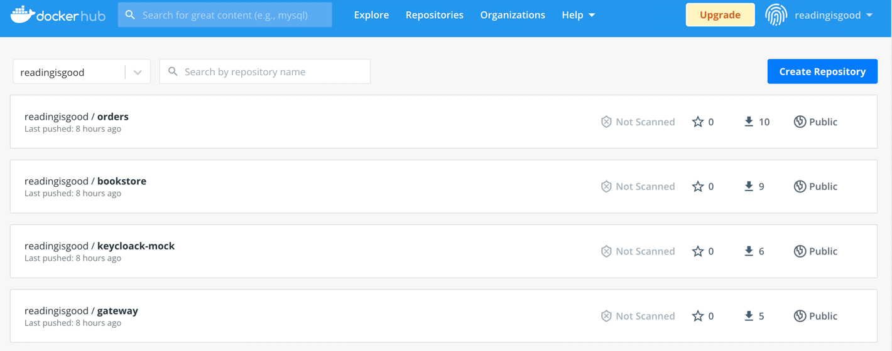
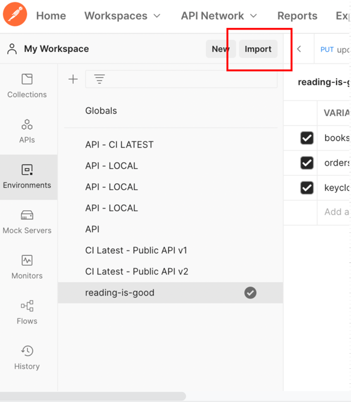
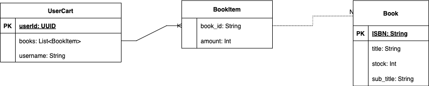

# Reading is Good

An online book marketplace, which manages the state of books as the enter a warehouse and 
move through orders. 

## Running the App

To run the application you can make use of the docker-compose file in this directory, to run the compose file 
you can run the following command:

> docker-compose up

To pull the latest images you can run 

> docker-compose pull

This will the four following images with the exposed ports as follows:

1. Keycloak-mock : `5000:5000`
2. Gateway : `8000:8000`
3. Bookstore : `8001:8001`
4. Orders : `8002:8002`
5. MongoDb : `27017:27017` 

## Building the Application  

This is a MVN Springboot Application, to build the application you will need mvn and at least java SDK11.

### Containers

The application builds each service into a docker image and publishes the image to Docker Hub, in order 
to build the images add the following to your `~/.m2/setting.xml` config file.

```xml
<servers>
   <server>
        <id>registry.hub.docker.com</id>
        <username>readingisgood</username>
        <password>j##f$(5t6rsMg/+</password>
   </server>
</servers>
```

Once you have added the credentials needed you can run the following command to build the application locally

> mvn install -U -DskipTests

> NB! The `skipTests` flag is necessary unless you first run an instance of MongoDB

A container library called JIB will then publish the locally created docker images to Docker Hub. The images 
are published to a `readingisgood` account on Docker Hub, you can use the password from the configuration above to log in
and view the available images. 



## Calling the Endpoints 

Once you have successfully run the `docker-compose up` command you can use this Postman collection and 
environment configuration files inside the `postman` directory. 

Just import the files in Postman 


## Architecture

The application is set up using a microservice architecture with the following core services:

1. Bookstore Gateway
2. Keycloak Mock
3. Bookstore 
4. Orders 

The following diagram shows how the services are connected:


### Bookstore Gateway 

A gateway into our application, this service is responsible for connecting with Keycloak and validating that 
requests made by user are authenticated. Adds the security layer needed by our application, should allow or 
deny access to specific endpoints depending on the user making the request

### Keycloak Mock 

A simple mock of the Keycloak third party library, this service manages the authentication of our users, their 
roles within the system. Ideally I would have probably used an actual Keycloak instance but to make things fast and 
easier for this assignment I am making a quick mock. 

### Bookstore 

The marketplace API for our online store, this service keep stock of books within the warehouse and the state of each 
book. Provides and API for the retrieval of books for the marketplace as well as the creation/entry of 
new books within the warehouse. 

The following diagram shows the Tables defined in the Bookstore



### Orders 

A service to manage the state of Orders once created, will provide an API to track/monitor and update the Order as it moves 
from one state to another, emitting events as the order goes through.

The following diagram shows the Tables defined in the Orders


## Running the Test

To run the test you need a local running MongoDb to set one up you can run the following command in any terminal

```text
docker run \       
-p 27017:27017 \
--name mongodb \
--rm \
mongo:latest

```

All the tests are set up as Integrations tests, however the fact that they need a running MongoDb connection to run is
not ideal. Would not do this in a real environment but for testing and debugging it has proven useful 